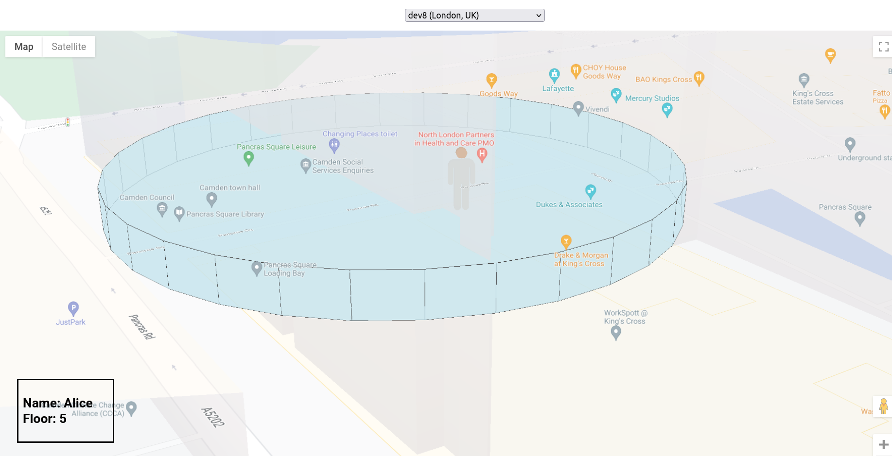

# 3D Augmented Google Map 

This is a web app that adds additional 3D layer on top of the Google Map JavaScript API. This [Google GitHub repo](https://github.com/googlecodelabs/maps-platform-101-webgl/) was used as a template.

## Tech Stack

HTML, CSS, JavaScript, Three.js, Google Map JavaScript API

## Run Locally

Clone the project

```bash
  git clone https://github.com/beketm/HackNU2022
```

Go to the project directory

```bash
  cd HackNU2022/starter
```

Install packages and dependicies

```bash
    npm i
```

Go to source directory

```bash
    cd src/
```

Run website 

```bash
    npm run
```


## Demo

